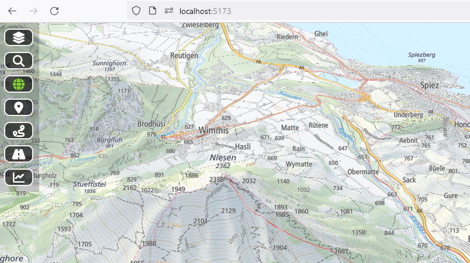
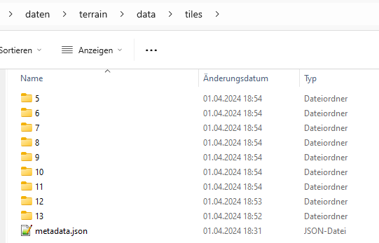

# terrain-rgb
Create a terrain-rgb from swissaltiregio



For a live demo see [https://swiss.mapview.ch/ml](https://swiss.mapview.ch/ml)


This repoitory explains in detail how to create a terran-rgb from the [swissALTIRegio](https://www.swisstopo.admin.ch/en/height-model-swissaltiregio) digital elevation model (DEM) from swisstopo. swissALTIRegio is a small scale digital height model that describes the surface without vegetation nor construction of Switzerland and regions of its neighbouring countries.

The dataset is delivered by swisstopo as a grid with a cellsize of 10m. In this guidance the Cloud Optimized Geotiff (COG,LZW-copression 12 GB / complete coverage) is used as a starting point.

For use of this DEM in mapping tools like maplibre-gl ist is necessary to convert the dataset to a terrain-rgb format, which then can be used to visualize a 3D-webmap. A terrain-rgb encodes the elevation for each pixel of a png or webp-image using this formula

```elevation = -10000 + ((R * 256 * 256 + G * 256 + B) * 0.1)```

The images can then be served a normal raster tiles in different zoom levels.

In this guidance the following tools are used:
- [maplibre-gl](https://maplibre.org/) for the visualization of the webmap an the 3D terrain
- [tileserver-gl](https://tileserver.readthedocs.io/en/latest/) for the delivery of the rbg-tiles
- [gdalwarp](https://gdal.org/programs/gdalwarp.html) for reprojection of the swissALTIRegio dataset to EPSG:3857
- [rio-rgbify](https://github.com/mapbox/rio-rgbify) for creation of the rgb-tiles
- [mb-util](https://github.com/mapbox/mbutil) for creating the final mbtiles file

## step 1: download of swissALTIRegio
The dataset can be donloaded from [https://data.geo.admin.ch/ch.swisstopo.swissaltiregio/swissaltiregio/swissaltiregio_2056_5728.tif](https://data.geo.admin.ch/ch.swisstopo.swissaltiregio/swissaltiregio/swissaltiregio_2056_5728.tif)
The size of the downloaded dataset is 12 GB. The projection of the dataset is in EPSG:2056

## step 2: reproject to EPSG:3858
Since maplibre can only visualize data in EPSG:3857 we reproject the dataset to this coordinate-system. We use gdalwarp for this:

```gdalwarp -t_srs EPSG:3857 -dstnodata None -novshiftgrid -co TILED=YES -co COMPRESS=DEFLATE -co BIGTIFF=YES  -r near swissaltiregio_2056_5728.tif swissaltiregio_3857.tif```

- -t_srs : indicates the target coordinate system
- -dstnodata None: datapoints with no data (in source as -3.4e+38) are markt as None, This is necessary as -3.4e38 is out of the range of a 3byte (as used in rgb)
- -r near: resampling method
- the reprojected file is named swissaltiregio_3857.tif

## step 3: create rgb tiles
For creation of the rgb-tiles rasterio is used with the plugin rgbify. The use of rgbify produces an error. This is addressed [here](rgbify.md).

```rio rgbify -b -10000 -i 0.1 --max-z 13 --min-z 5 --format webp -j 16 swissaltiregio_3857.tif swissaltiregio.mbtiles```

- -b and -i are used for the encoding of the eleveation, representing the above formula
- --min-z, max-z indicates the minimal an deth maximal zoomlevels for which the tiles are created.
  At zoomlevel 13 we have an resolution of 13m/pixel, so there is no sense to gor further, as the resulution of swissALTIRegio is 10m.
- --format webp: we use the webp image format which produces smaller image tiles than png.
  It is important to use this the lossless compression, as lossy compression would produce artifacts. It seems that this is the default of rgbify
- The final swissaltiregio.mbtiles has a size of 3.2 GB and could be used directly by tileserver-gl

As outlined by Frédéric Rodrigo in [Optimization of RGB DEM tiles for dynamic hill shading with Mapbox GL or MapLibre GL](https://medium.com/@frederic.rodrigo/optimization-of-rgb-dem-tiles-for-dynamic-hill-shading-with-mapbox-gl-or-maplibre-gl-55bef8eb3d86) the size of 3.2 GB can be optimized by rounding the less relevant bits of the rgb encoding to 0. This allows a more efficient compression of the webp-image-tiles. The rounding will be different according to the zoomlevel. On low zoomlevels we can have a bigger rounding than in high zoomlevels. For this to be done we have to replace the rgbify command by the following command per zoomlevel. (The use of the parameter --round-digits produces an error because it is not in the default distribution of rgbify when installed via pip. This issue is addressed [here](rgbify.md)
```
rio rgbify -b -10000 -i 0.1 --max-z 5 --min-z 5 --format webp -j 16 --round-digits 11 swissaltiregio_3857.tif swissaltiregio_05.mbtiles
rio rgbify -b -10000 -i 0.1 --max-z 6 --min-z 6 --format webp -j 16 --round-digits 10 swissaltiregio_3857.tif swissaltiregio_06.mbtiles
rio rgbify -b -10000 -i 0.1 --max-z 7 --min-z 7 --format webp -j 16 --round-digits 9 swissaltiregio_3857.tif swissaltiregio_07.mbtiles
rio rgbify -b -10000 -i 0.1 --max-z 8 --min-z 8 --format webp -j 16 --round-digits 8 swissaltiregio_3857.tif swissaltiregio_08.mbtiles
rio rgbify -b -10000 -i 0.1 --max-z 9 --min-z 9 --format webp -j 16 --round-digits 7 swissaltiregio_3857.tif swissaltiregio_09.mbtiles
rio rgbify -b -10000 -i 0.1 --max-z 10 --min-z 10 --format webp -j 16 --round-digits 6 swissaltiregio_3857.tif swissaltiregio_10.mbtiles
rio rgbify -b -10000 -i 0.1 --max-z 11 --min-z 11 --format webp -j 16 --round-digits 5 swissaltiregio_3857.tif swissaltiregio_11.mbtiles
rio rgbify -b -10000 -i 0.1 --max-z 12 --min-z 12 --format webp -j 16 --round-digits 4 swissaltiregio_3857.tif swissaltiregio_12.mbtiles
rio rgbify -b -10000 -i 0.1 --max-z 13 --min-z 13 --format webp -j 16 --round-digits 3 swissaltiregio_3857.tif swissaltiregio_13.mbtiles
```
- --round-digits indicates the number of digits on the right side which are set to 0
- each zoomlevel is converted separatly, which produces individual mbtiles files

The mbtiles files cannot be used directly by tileserver so we have to merge them together in step 4

## step 4: merge the mbtiles files to a single one
For this final step we use the tool mb-util twice. 
- First we extract the tiles out of the single mbtiles file
- Second we merge the files together

### Extraction of the mbtiles files
```
mb-util --image-format=webp swissaltiregio_05.mbtiles ./tiles05
mb-util --image-format=webp swissaltiregio_06.mbtiles ./tiles06
...
```
This produces a folder for each zoom-level

We merge this folder so that all zoomlevels are in a single folder ./tiles
We have to create a file ./tiles/metadata.json describing the tileset:
```
{
  "format": "webp",
  "name": "swissALTIRegio",
  "description": "terrainrgb for swissALTIRegio",
  "version: "1",
  "minzoom": 5,
  "maxzoom": 15,
  "attribuition": "Bundesamt für Landestopografie swisstopo; Tarquini S., I. Isola, M. Favalli, A. Battistini, G. Dotta (2023). TINITALY, a digital elevation model of Italy with a 10 meters cell size (Version 1.1). Istituto Nazionale di Geofisica e Vulcanologia (INGV). https://doi.org/10.13127/tinitaly/1.1; DGM Österreich, geoland.at; DGM1, Bayerische Vermessungsverwaltung – www.geodaten.bayern.de; EU-DEM, provided under COPERNICUS by the European Union and ESA, all rights reserved; RGEAlti, Institut National de l’information géographique et forestière, données originales tétéchargées sur https://geoservices.ign.fr/rgealti#telechargement5m, mise à jour du juillet 2023"
}
```


### create the final mbtiles file
Now we can convert the tiles to the final mbtiles file with
```
mb-util --image-format=webp ./tiles/ swissaltiregio.mbtiles
```

This file is of size 1.6 GB which is half of the size without the rounding
