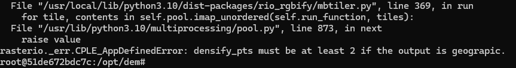
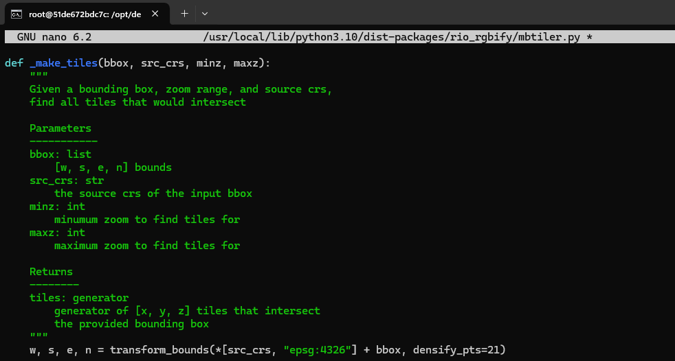

## densify_pts musst be at least 2
The use of rgbify produces an error : densify_pts musst be at least 2


We can workaround this error by edition the offending file mbtiler.py

In the function _make_tiles change the default of densify_pts=0 to densify_pts=21


## No such option: --round-digits Did you mean --bounding-tile?
We have to install the latest version directly from github:
```
git clone https://github.com/mapbox/rio-rgbify.git
cd rio-rgbify
pip install -e .
```
